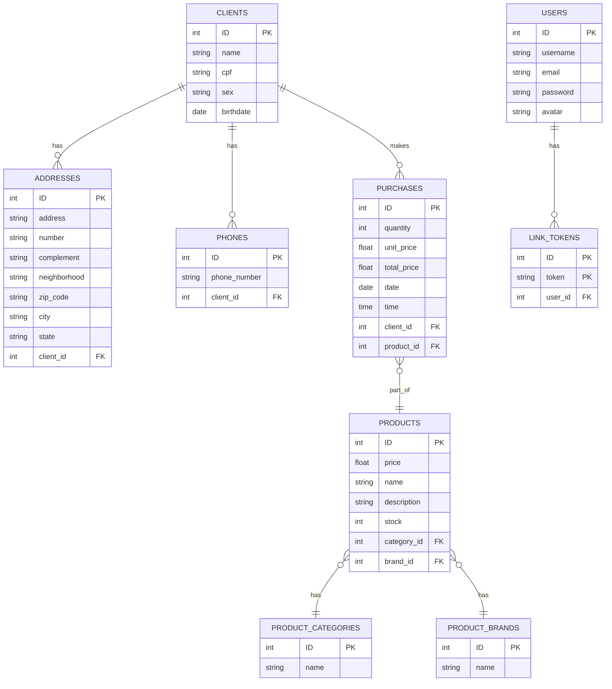

```mermaid
erDiagram
    USERS {
        int ID PK
        string username
        string email
        string password
        string avatar
    }
    %% SESSIONS {
    %%     int ID PK
    %% }
    CLIENTS {
        int ID PK
        string name
        string cpf
        string sex
        date birthdate
    }
    ADDRESSES {
        int ID PK
        string address
        string number
        string complement
        string neighborhood
        string zip_code
        string city
        string state
        int client_id FK
    }
    PHONES {
        int ID PK
        string phone_number
        int client_id FK
    }
    PRODUCTS {
        int ID PK
        float price
        string name
        string description
        int stock
        int category_id FK
        int brand_id FK
    }
    PRODUCT_CATEGORIES {
        int ID PK
        string name
    }
    PRODUCT_BRANDS {
        int ID PK
        string name
    }
    PURCHASES {
        int ID PK
        int quantity
        float unit_price
        float total_price
        date date
        time time
        int client_id FK
        int product_id FK
    }
    LINK_TOKENS {
        int ID PK
        string token PK
        int user_id FK
    }

    CLIENTS ||--o{ ADDRESSES : has
    CLIENTS ||--o{ PHONES : has
    CLIENTS ||--o{ PURCHASES : makes
    PURCHASES }o--|| PRODUCTS : part_of
    PRODUCTS }o--|| PRODUCT_CATEGORIES : has
    PRODUCTS }o--|| PRODUCT_BRANDS : has
    USERS ||--o{ LINK_TOKENS : has
```
