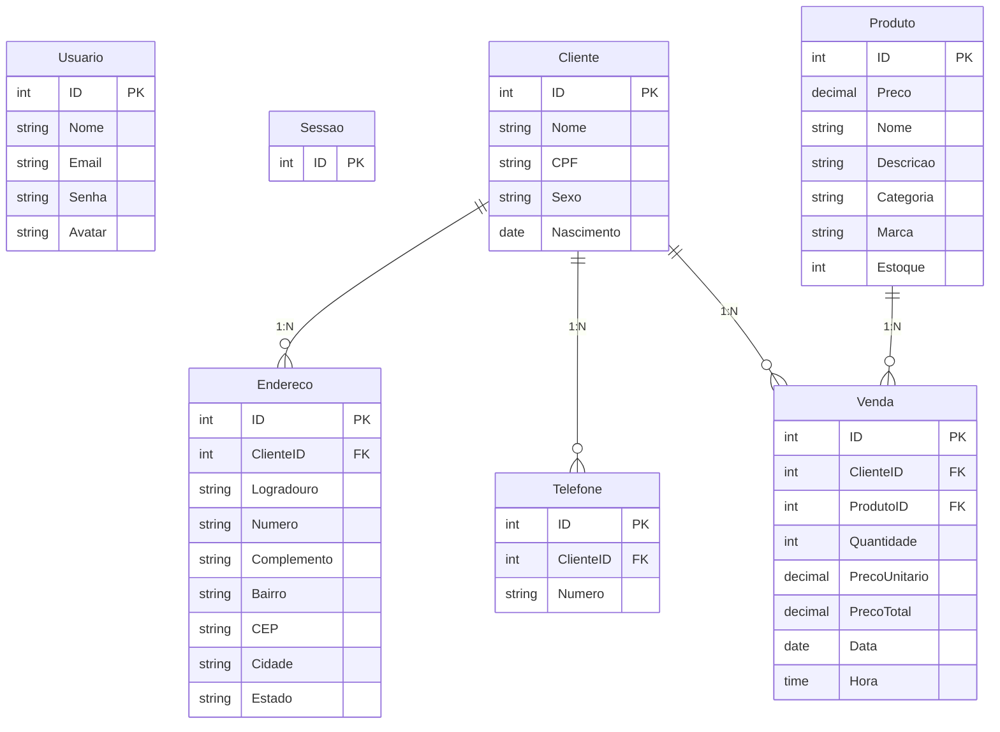

```mermaid
erDiagram
    Usuario {
        int ID PK
        string Nome
        string Email
        string Senha
        string Avatar
    }

    Sessao {
        int ID PK
    }

    Cliente {
        int ID PK
        string Nome
        string CPF
        string Sexo
        date Nascimento
    }

    Endereco {
        int ID PK
        int ClienteID FK
        string Logradouro
        string Numero
        string Complemento
        string Bairro
        string CEP
        string Cidade
        string Estado
    }

    Telefone {
        int ID PK
        int ClienteID FK
        string Numero
    }

    Produto {
        int ID PK
        decimal Preco
        string Nome
        string Descricao
        string Categoria
        string Marca
        int Estoque
    }

    Venda {
        int ID PK
        int ClienteID FK
        int ProdutoID FK
        int Quantidade
        decimal PrecoUnitario
        decimal PrecoTotal
        date Data
        time Hora
    }

    Cliente ||--o{ Endereco : "1:N"
    Cliente ||--o{ Telefone : "1:N"
    Cliente ||--o{ Venda : "1:N"
    Produto ||--o{ Venda : "1:N"
```
