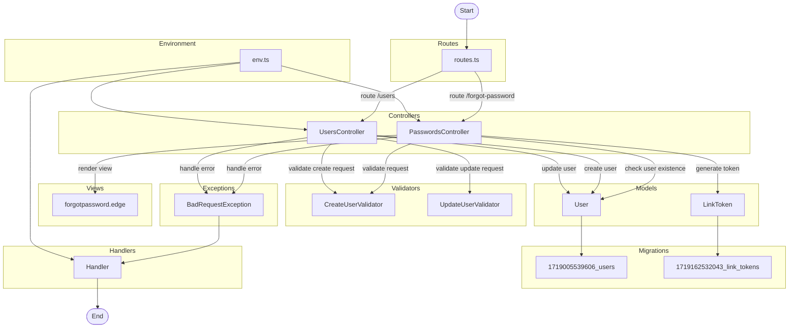

```mermaid
flowchart TD
  %% Início e Fim
  Start([Start]) --> H1
  G1 --> End([End])

  %% Controllers
  subgraph Controllers
    A1[PasswordsController]
    A2[UsersController]
  end

  %% Validators
  subgraph Validators
    B1[CreateUserValidator]
    B2[UpdateUserValidator]
  end

  %% Models
  subgraph Models
    C1[User]
    C2[LinkToken]
  end

  %% Database Migrations
  subgraph Migrations
    D1[1719005539606_users]
    D2[1719162532043_link_tokens]
  end

  %% Views
  subgraph Views
    E1[forgotpassword.edge]
  end

  %% Exceptions
  subgraph Exceptions
    F1[BadRequestException]
  end

  %% Handlers
  subgraph Handlers
    G1[Handler]
  end

  %% Routes
  subgraph Routes
    H1[routes.ts]
  end

  %% Environment
  subgraph Environment
    I1[env.ts]
  end

  %% Application Flow
  H1 --> |route /forgot-password| A1
  H1 --> |route /users| A2

  %% PasswordsController Flow
  A1 --> |validate request| B1
  A1 --> |check user existence| C1
  A1 --> |generate token| C2
  A1 --> |render view| E1
  A1 --> |handle error| F1

  %% UsersController Flow
  A2 --> |validate create request| B1
  A2 --> |create user| C1
  A2 --> |validate update request| B2
  A2 --> |update user| C1
  A2 --> |handle error| F1

  %% Error Handling
  F1 --> G1

  %% Database Relations
  C1 --> D1
  C2 --> D2

  %% Environment Configurations
  I1 --> A1
  I1 --> A2
  I1 --> G1
```
